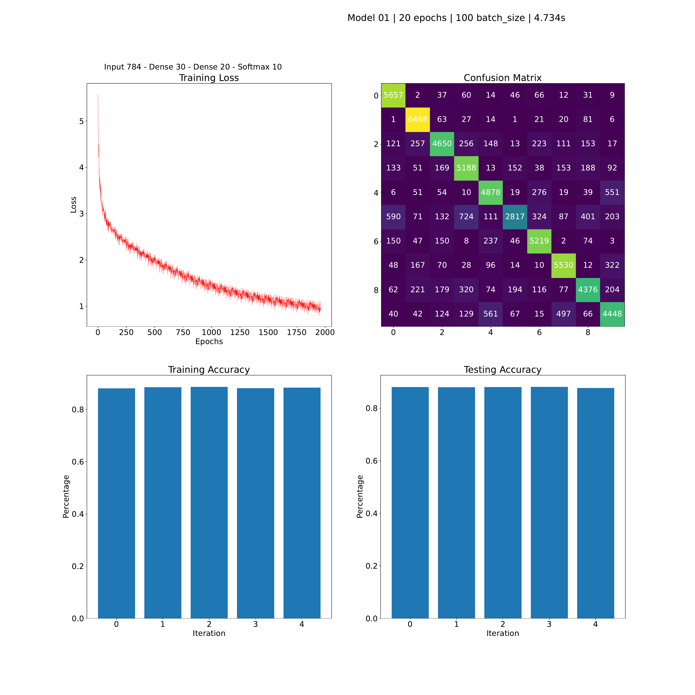
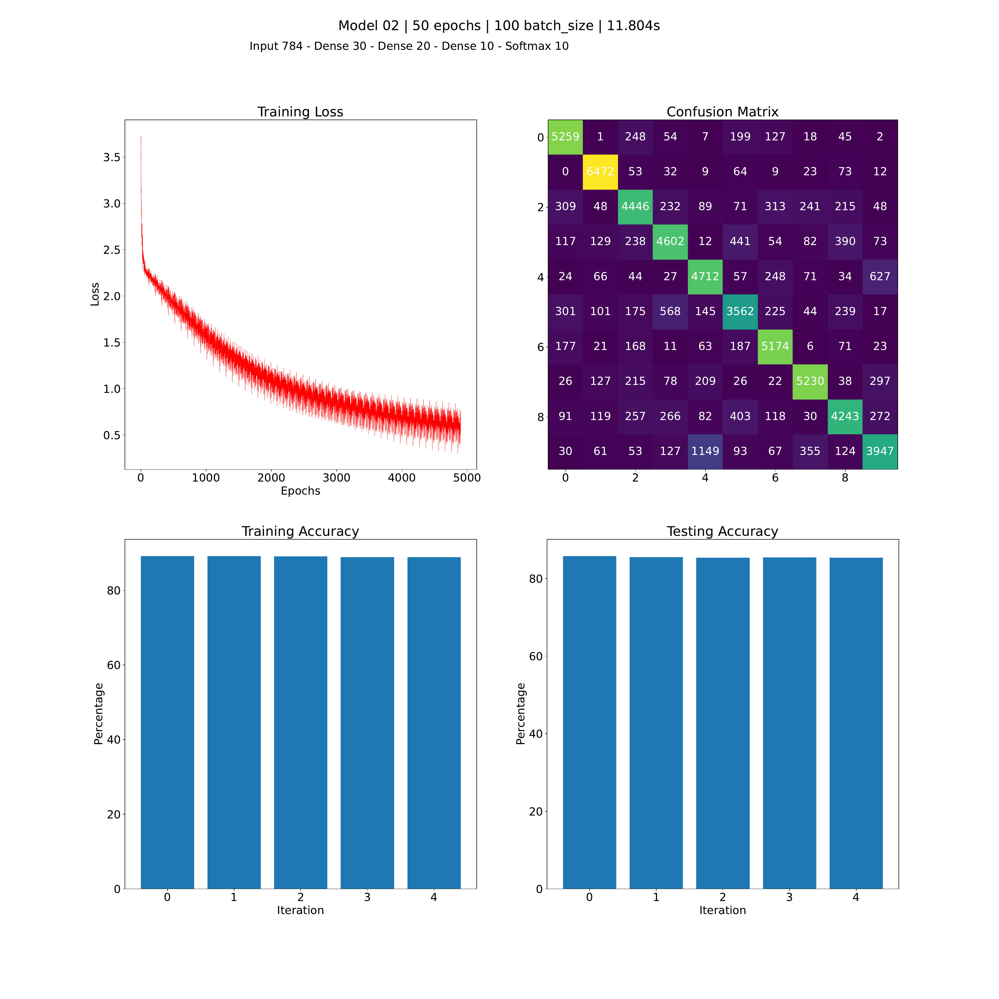
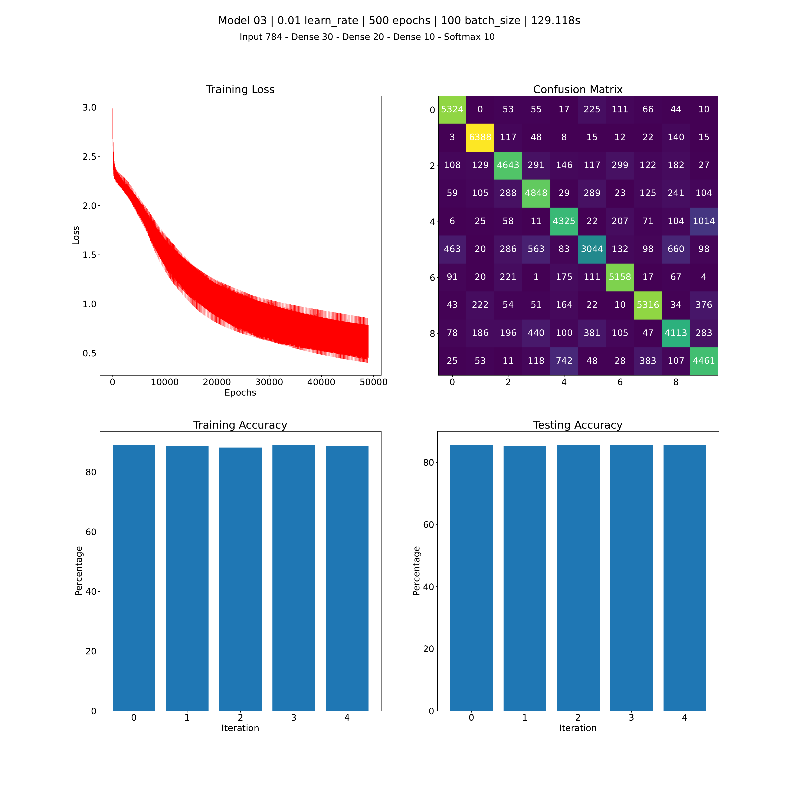
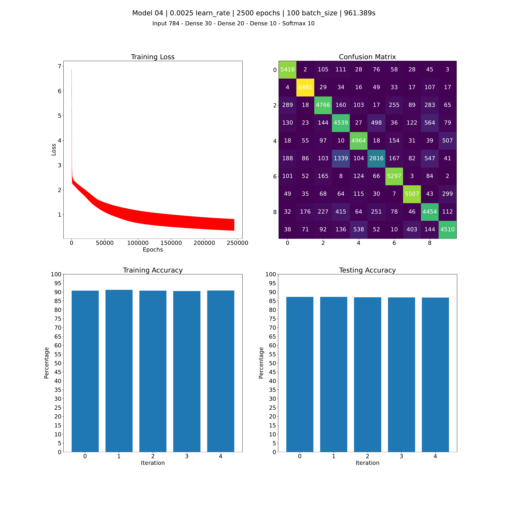
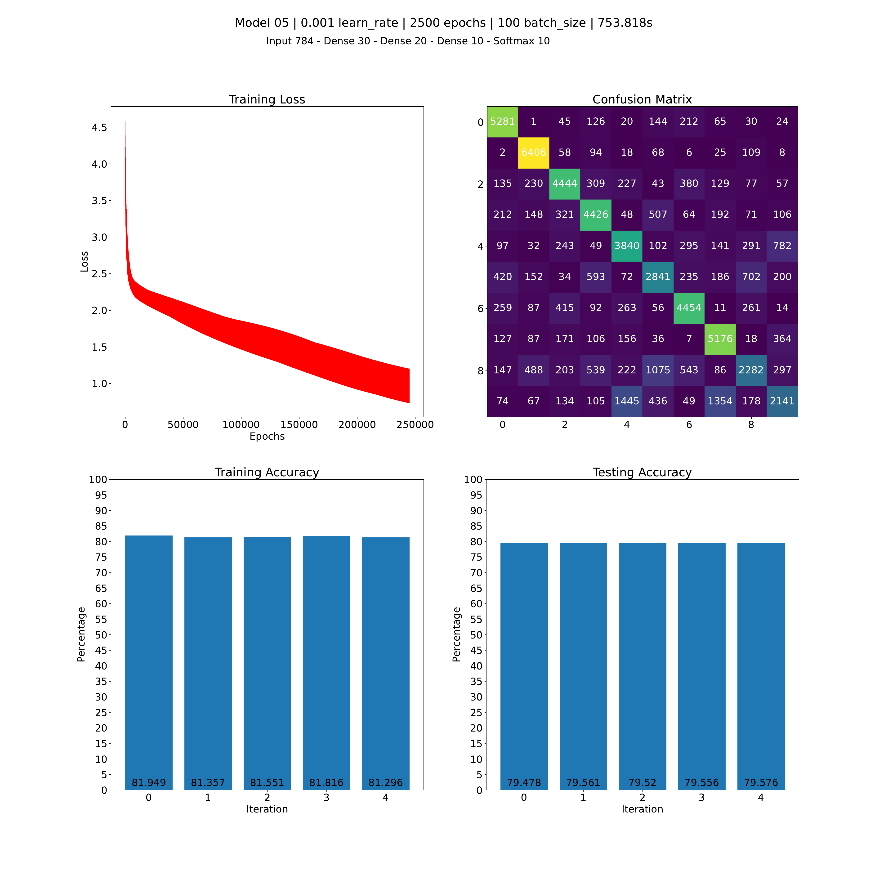

# Neural Networks from Scratch 
#### CSCI 567 Assignment #3

## Goal
Create a Neural Network from scratch using only `numpy` for handwritten image recognition on MNIST dataset.

## Scope
The scope of the assignment only included using Dense and Softmax layers, however, the implementation was extended to include basic renditions of Convolution and Max Pooling layers, to complete a holistic learning of how these layers work underneath. This codebase could be extended in the future to include other NN layers like LSTM etc. However, it is to be noted that performance for training multi-layered CNNs is very poor due to no parallelization beyond the scope of what numpy does under its hood.

## Results
5 models with different hyperparameters were tested the results of which are shown below:

---
Baladitya Swaika, *November 2021*